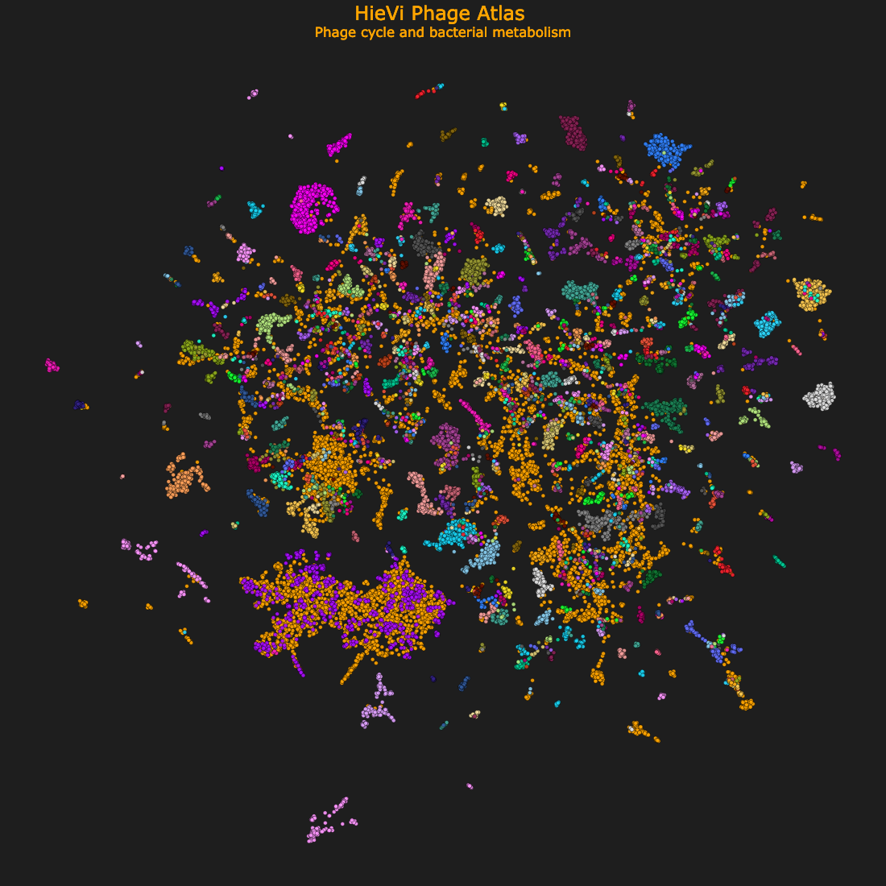

# HieVi - Leveraging protein Language Models for bacteriophages comparative genomics
---

2D visualisation (UMAP projection) of the embedding space comprising vector representations of 24,362 prokaryotic viral proteomes generated with HieVi. Viruses are colored by their annotated ICTV genus (unknown genera are plotted in orange).

**This interactive UMAP can be browsed at:**

https://pswapnesh.github.io/HieVi/HieVi_UMAP.html

---
## Online HieVi use-case for a single genome query

Users can compare a single genome (DNA sequence in FASTA format) with the current HieVi database at:

https://huggingface.co/spaces/pswap/hievi

---
# HieVi pipeline installation
## 📥 Download dataset and faiss index

Download and save the two files in the same directory. 

*Nearest neighbour index (Faiss index)*

https://zenodo.org/records/17018992/files/Inphared_14Apr_float64_t36_meanCls_3b.zarr_faiss_index.bin?download=1

*Metadata*

https://zenodo.org/records/17018992/files/Inphared_14Apr_float64_t36_meanCls_3b.zarr_faiss_metadata.json?download=1

## 🛠️ Installation

### 1. Create and activate the Conda environment

```bash
conda env create -f environment.yml
conda activate hievi
```

Clone this project onto a local folder
```bash
cd your_folder
git clone https://github.com/pswapnesh/HieViSearch.git
```


## 🚀 Usage
```bash
python hievi.py \
  --experiment_name test \
  --query_fasta_path test/test.fasta \
  --faiss_index_path path/to/faissbin.bin \
  --output_folder path/to/output
```
To output only the nearest neighbours of your genomes (relatively faster)
```bash
python hievi_search.py \
  --experiment_name test \
  --query_fasta_path test/test.fasta \
  --faiss_index_path path/to/faissbin.bin \
  --output_folder path/to/output
  --k_neighbours 64
```

## Expected execution time
Apart from the model loading, which takes a few seconds. Each contig is processed in less 2 seconds per contig (of size ~ 30kbp) (GPU).

## 📂 Output
The output is structured as bgiven below.
- ```nearest_neighbour_accessions.csv``` contains a table of the query accession and the k-nearest neighbour accessions in the database
- ```experimentName_nearest_in_tree.csv``` contains the k-nearest accession in the condensed tree
- ```hievi_network.gexf``` contains the combined tree of all the qery and relevant accessions in the database 

```php-template
Output_Folder/
├── Phage_01/
├── Phage_02/
│   └── prodigal_outputs
├── hievi_network.gexf
├── <experiment_name>_nearest_in_tree.csv
└── nearest_neighbour_accessions.csv
```

## Visualization
Cytoscape is recommended with gexf-app and yFiles Layout Algorithms.

## 📫 Cite
Swapnesh Panigrahi, Mireille Ansaldi, Nicolas Ginet
https://www.biorxiv.org/conthttps://sdrive.cnrs.fr/s/kBwgyYe6rwjmNgZ

(accepted paper link, soon!)
